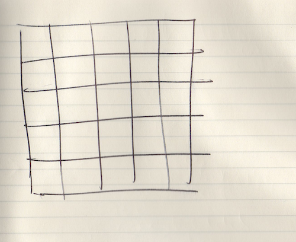
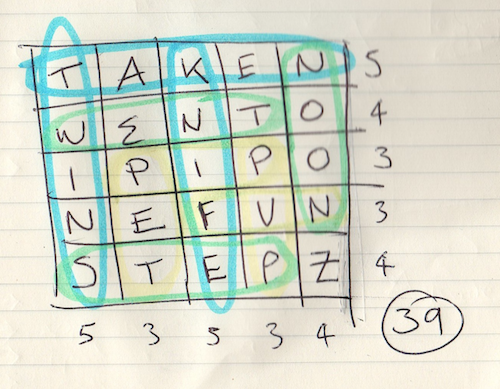

# The Crossword Game

**The Crossword Game** is an old game my family traditionally plays at Christmas time. It requires nothing but a handful of players, a few sheets of paper and some pens. Oh, and the ability to get along even when you are feeling seriously competitive!

## How To play

### Before you start

The Crossword Game is a game for 2-6 players. You can play with more, but it gets harder to play strategically.

Each player needs a sheet of paper and a pen.

Each player should draw a 5x5 grid on their paper, with enough space to write a single letter in each cell.

### The first turn

Pick a player to take the first turn. It could be the youngest player, the oldest player, or the first person to shout 'MEEE'…

The first player chooses a letter and announces it to all players

All players must now place this letter into the grid on their piece of paper.

Players should keep their grid secret from other players to prevent cheating!

### The next turn

Move around the room clockwise- each player in turn chooses a letter, announces it to the room, and all players decide where to put that letter into the grid on their piece of paper.

### The end of the game

When all of the squares of the grids are full, the game is over, and it's time to work out each players' score.

The winner is the player with the highest score.

## Scoring

Words in horizontal and vertical alignment score according to the following list. 

Only one word may score per row or column.

Score 3 points for each 3 letter word

Score 4 points for each 4 letter word

Score 5 points for each 5 letter word

Example showing three, four and five point words to get a total of 39 points

### Additional Rules

Bonus Choice: To fill the last grid square, just before the end of a game, each player chooses their own letter instead of the normal method. Bear this in mind during the game- you can really use it to your advantage!

Agree in advance a dictionary you will use in the event of conflict! I personally allow pluralisation and abbreviations, but not acronyms, but obviously it is up to you.

